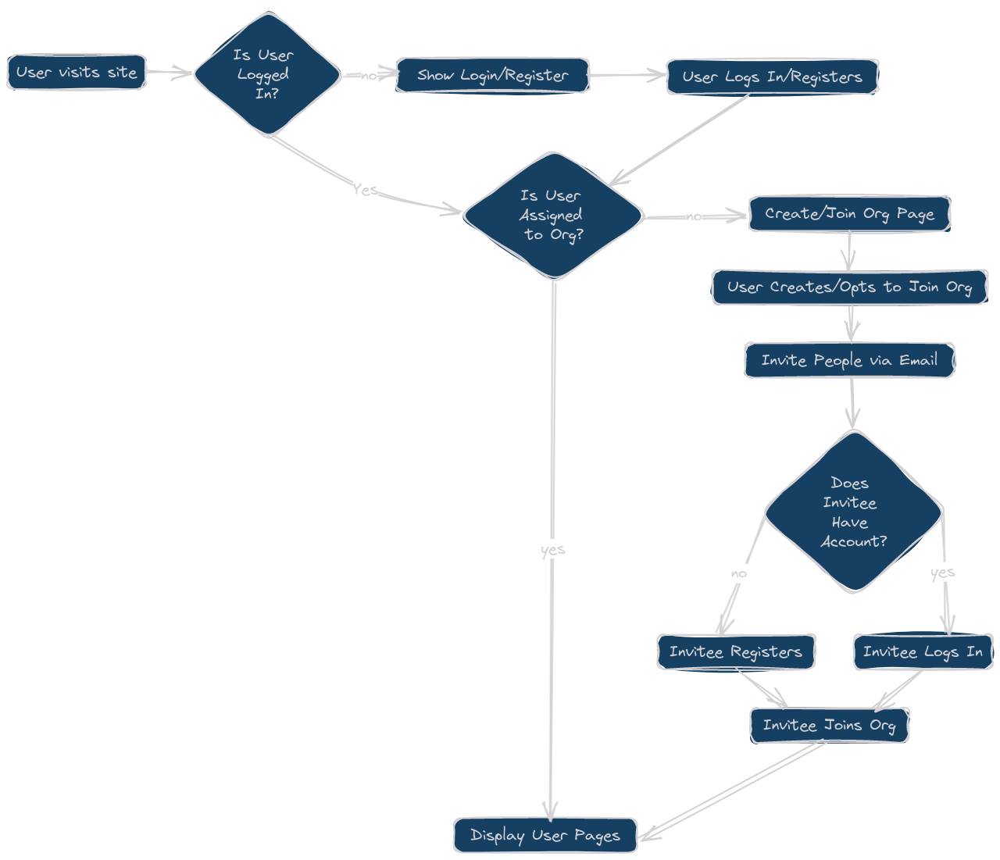

# Initial user flow

## Flow Summary

1. **Initial Site Visit**

   - When a user visits the site, they are first checked to see if they are logged in.

2. **Login / Registration**

   - If not logged in, the user is prompted to log in or register.
   - After logging in or registering, the flow continues to check the user's association with an organization.

3. **Organization Association**

   - If the user is not assigned to an Org, they are directed to a page where they can create or join an Org.
   - Upon creating an Org or opting to join one, the user can invite people via email.

4. **Invitation Process**

   - When an invitee receives an email, they are checked for an existing account.
   - If the invitee does not have an account, they must register.
   - If the invitee has an account, they simply log in.

5. **Org Joining**

   - Once logged in or registered, the invitee joins the Org.

6. **User Pages Display**
   - After the user is associated with an Org (either by direct association or through the invitation process), the user's pages are displayed
